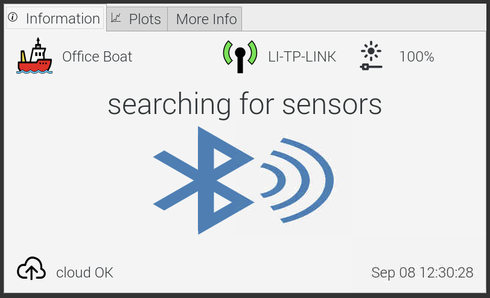

# Deck Data Hub

Application to download Bluetooth-enabled data loggers in fishing and research vessels.

## BLE dongles

You can attach your external BLE USB dongle and see if it works with DDH. This should give you even increased communication range.

We had success with EDUP dongles and several others.

## GUI shortcuts

- To enable / disable Bluetooth, press 'b' key, release it and click main icon text.
- To show / hide edit tab, press 'e' key, release it and click main icon text.
- To show / hide edit tab, you can also hold the boat icon for 3 seconds and release.
- To minimize GUI, press 'm' key, release it and click main icon text.
- To minimize GUI, you can also hold the GUI field containing the datetime for 3 seconds and release.
- To show / hide advanced tab, you can hold the GUI field containing the version for 3 seconds and release. 
- To force a cloud sync, you can click the cloud icon.
- To quit DDH, press 'q' key, release it and click main icon text.
- To quit DDH, you can also hold the GUI uptime field for 3 seconds and release.

## License

This project is licensed under GPL License - see COPYING file for details
