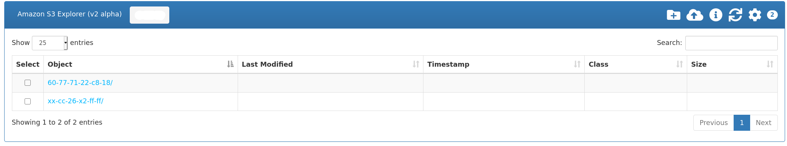
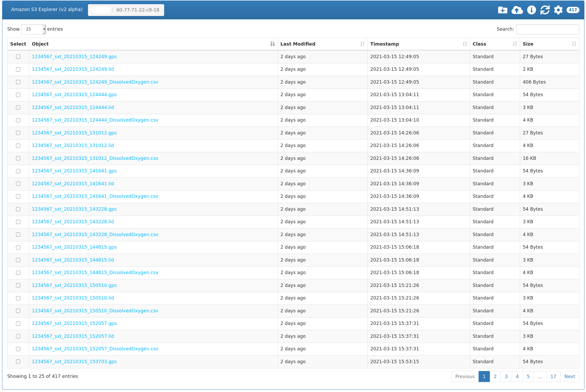

.. _data:

The DDH Data
============

You can check the data uploaded by all your DDH online. For this, in order to keep some confidentiality, you will need some information from us.

The data is stored on Amazon's cloud, so called AWS S3, and it can be checked by visiting the proper link, which will welcome you with this login:

.. figure:: aws_login.png
    :width: 500px
    :align: center
    :height: 700px
    :alt: DDH login for AWS
    :figclass: align-center

    The DDH login for AWS

We will provide your link as well as the information to be typed in the areas indicated by the green dots in the figure. When successfully logged in, the user is presented with an easy way to navigate the files uploaded by their loggers. For example, there are 2 logger folders listed in the following screenshot. Click the image for an enlarged view of it.

    AWS listing 2 logger folders

When selecting one of them, we will find the proper sets of files for each deployment of this logger: the GPS file, the LID file and the CSV file.

    AWS listing the files pertaining to one logger

Depending on your permissions, and as indicated in the upper-right icons, you can upload, delete and download these files and folders.
