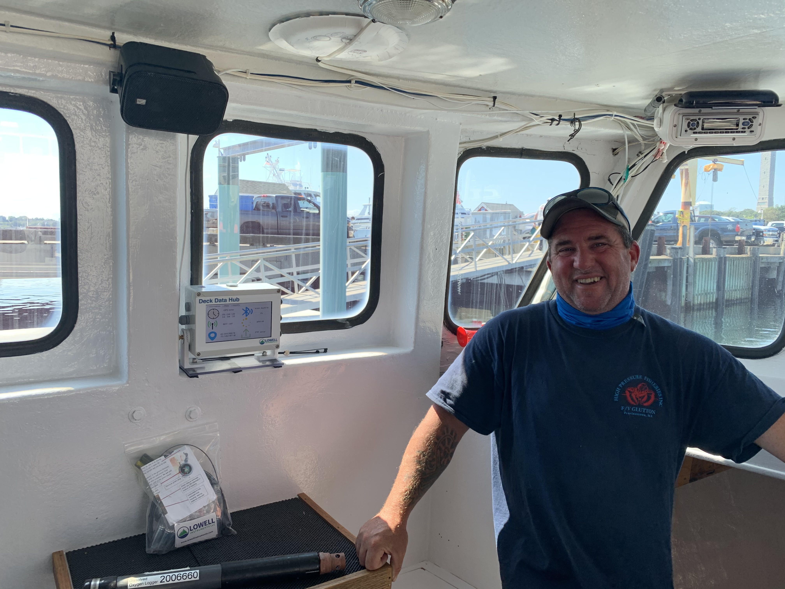

.. _description:

Description
===========

The Deck Data Hub, or DDH, is a system intended for use by commercial fishing boats
to aggregate data from wireless data loggers previously deployed in their operation areas.

    Mike Rego, owner of Ms. Lilly lobster boat out of Provincetown, MA, pictured with an on Deck Data Hub and a logger.

The system works completely unattended, scanning and detecting nearby wireless loggers, and downloading, re-configuring
and setting them up for the next deployment in a completely automatic manner. The downloaded data is then uploaded
to cloud services. The entire system can operate without a single intervention from the user. However,
the interface also provides tailored capabilities to access real-time and historical data.

The DDH system is comprised by hardware and software parts, which we show and describe in the following sections.
