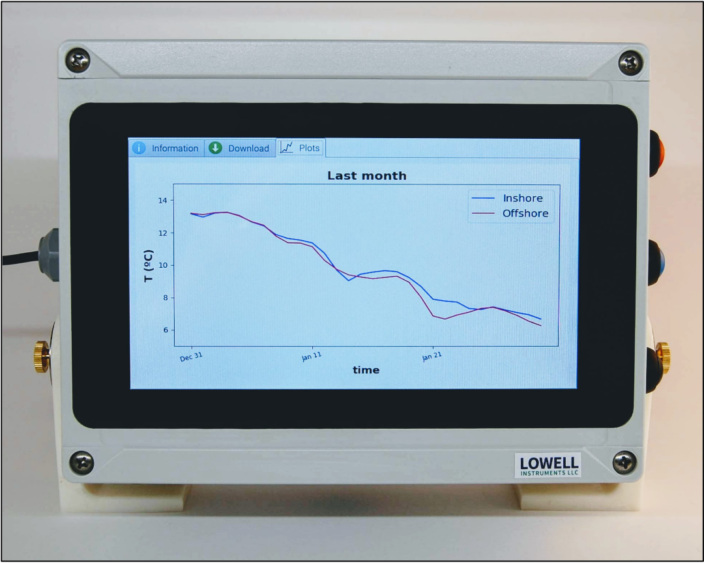
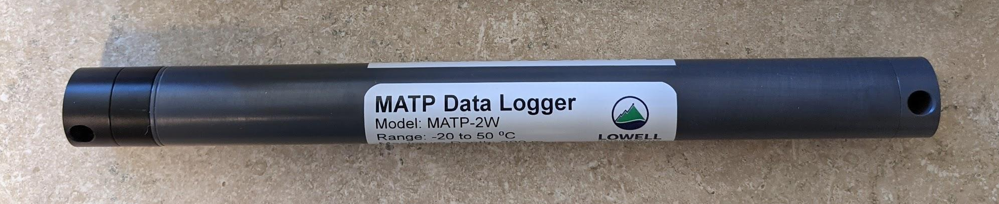

.. _hardware:

The DDH Hardware
================

The DDH hardware consists in a Raspberry Pi Model 3B+, or Rpi, in an IP-68 enclosure. To such RPi,
we connect an additional cell communications hat which also features a GPS receiver and an additional power support hat
to prevent data corruption in case of sudden power loss in the vessel.

    DDH hardware box

The main purpose of a DDH system is to query wireless loggers. For this, the DDH can use either its integrated
Bluetooth Low Energy transceiver or an external dongle, which allows
for more flexible installation scenarios. A picture of a logger from Lowell Instruments can be seen in
the following figure:

    Hardware loggers

Lowell Instruments manufactures a wide selection of loggers sporting different
sensor technologies and types. The DDH automatically detects, downloads and re-setups
these loggers once it detects them and it does in a smart manner which
avoids querying the same loggers over and over.

As mentioned, DDH come already setup. Out of curiosity, these are some steps involved when building one from scratch or to clone
one already built:

.. toctree::
   :maxdepth: 1

   hw-build
   hw-clone
   hw-access
   hw-test
