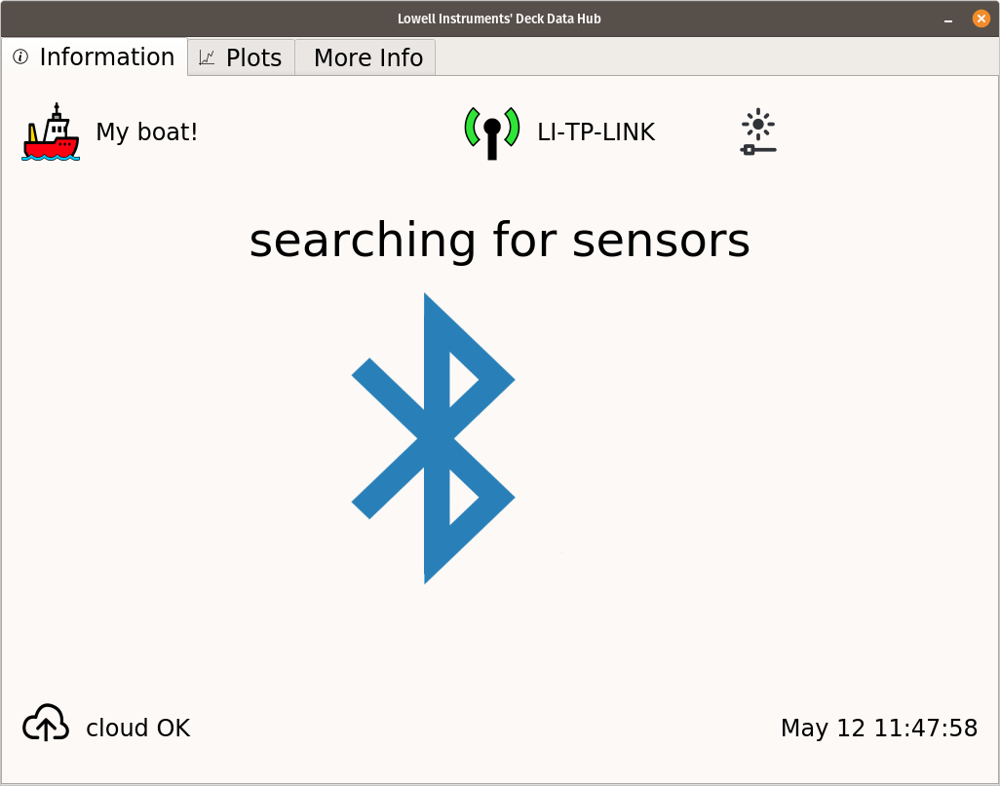

.. _software:

The DDH Software
================

The software is entirely written in python3 and comprises a Graphical User Interface, or GUI,
which main screen is shown next, built on top of a so-called MAT library from Lowell Instruments.
There is no need to understand or check the MAT library to use the DDH.

    The DDH Graphical User Interface

In the DDH project, loggers are intended to be attached to fishing equipment such as cages. As an application
example, when a fisherman arrives to a fishing spot, it recovers its lobster cage and hauls
it up to the fishing vessel. When the onboard DDH detects a logger, it records its current GPS position. Then,
it stops the logger, stopping a data collection which probably has been running for months. Next, it downloads,
checks and converts the binary data files in the logger as a CSV friendly format. Finally,
it re-setups the logger, performs sanity configuration checks and re-runs it so if the cage is re-deployed
the next data files recovered will start at the current precise time.

DDH are delivered with all the software already pre-installed.

.. toctree::
   :maxdepth: 1

   sw-configuring
   sw-running
   sw-developing
