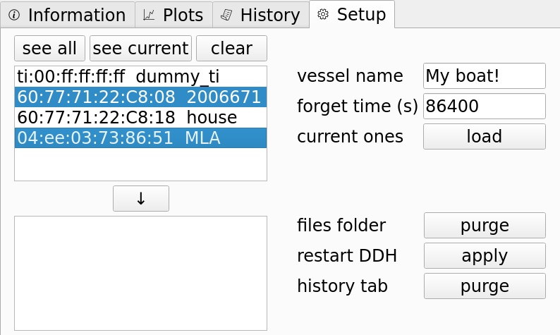

.. _sw-configuring:

Configuring it
##############

The DDH behavior is set in a single configuration file named `'ddh.json'`.
In the following snippet, we highlight the most important lines.

.. code-block:: JSON
   :caption: An example DDH configuration file ddh.json
   :linenos:
   :emphasize-lines: 4,8,9,10,11

    {
        "comment": "auto-generated by DDH setup tab, do not edit",
        "db_logger_macs": {
            "60:77:71:22:C8:08": "2006671",
            "60:77:71:22:C8:18": "house",
        },
        "ship_name": "My boat!",
        "forget_time": 86400,
         "units_temp": "F",
         "units_depth": "m",
        "comment": ".... here comes more stuff but we skipped it"
        }
    }

The `'db_logger_macs'` entry contains the whitelist of loggers which a DDH
recognizes and will query upon detection. Each logger entry comprises its MAC
address and its friendly name.

Line 8, `'forget_time'`, in seconds, represents for how long a DDH will ignore a
logger once it is detected, downloaded and re-configured. This prevents the DDH from
constantly detecting and interacting with the same loggers. This setting
is for when the DDH is inland, or maybe at a lab.

Line `'units'` entries allow the data plots to be shown in `'F'`, for Fahrenheit, or `'C'`, for Celsius.

There is a utility within the DDH GUI to generate `'ddh.json'` files. Such utility can only
be accessed while doing a remote desktop session to the DDH. Since the DDH
has no keyboard attached, this can only be achieved during a remote desktop session. Please
contact us to know how to open this utility.
This will create and open a fourth tab shown next:

    DDH Configuration tab

The utility buttons have straightforward names. To set the MAC addresses to be monitored by the
DDH, just select them from the leftmost box and press the downwards arrow button. You can previously
load the current MAC addresses the DDH is working with, or a file. When finished, just press the
button next to `'restart DDH'` label. This will effectively write the new `'ddh.json`' file
after a couple checks and will stop the DDH. Since the underlying Linux operating system in the DDH is
configured to check this GUI to be always running, the GUI will pop up again
after a couple of minutes, reloading any original or modified `'ddh.json`' file.
This configuration or setup tab additionally allows you to delete all any existing data
files and/or history logs so user must be really sure when using such buttons. This fourth
tab can be hidden again by ``shift + clicking`` the Internet Connectivity icon again. This mechanism
to open and close the configuration tab is done on purpose in order to prevent accidental
interaction with it.

An existing `'ddh.json'` file can also be generated by hand. The DDH GUI only takes into account
the configuration file once when booted, so to load a modified `'ddh.json'`, just close and
re-open the application. This can also be achieved by switching off the DDH completely with
the top power button.

The `'ddh.json'` file can have a couple more parameters, although the rest of parameters have been omitted
from this explanation since they are not intended to be modified by the final user.
